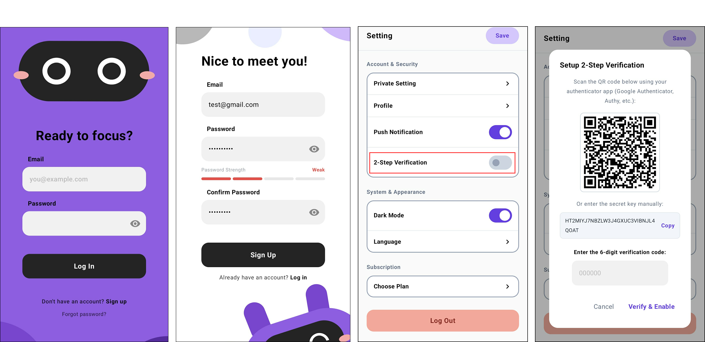
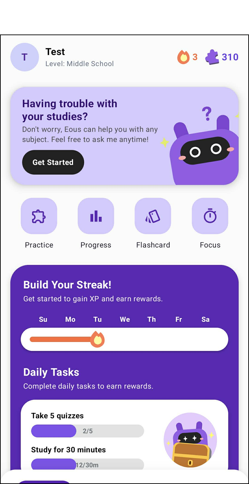
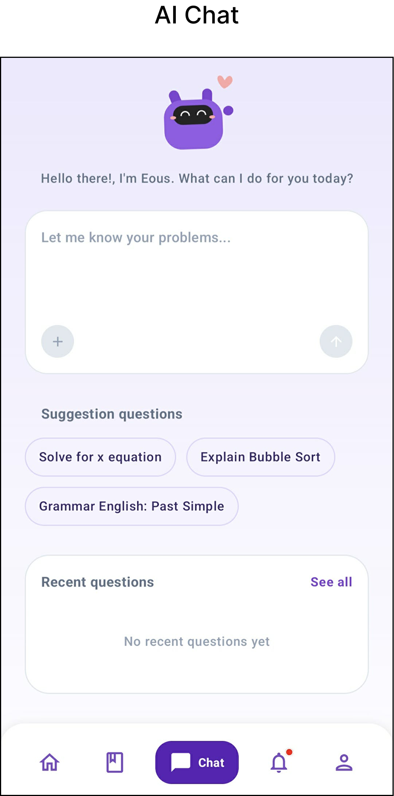
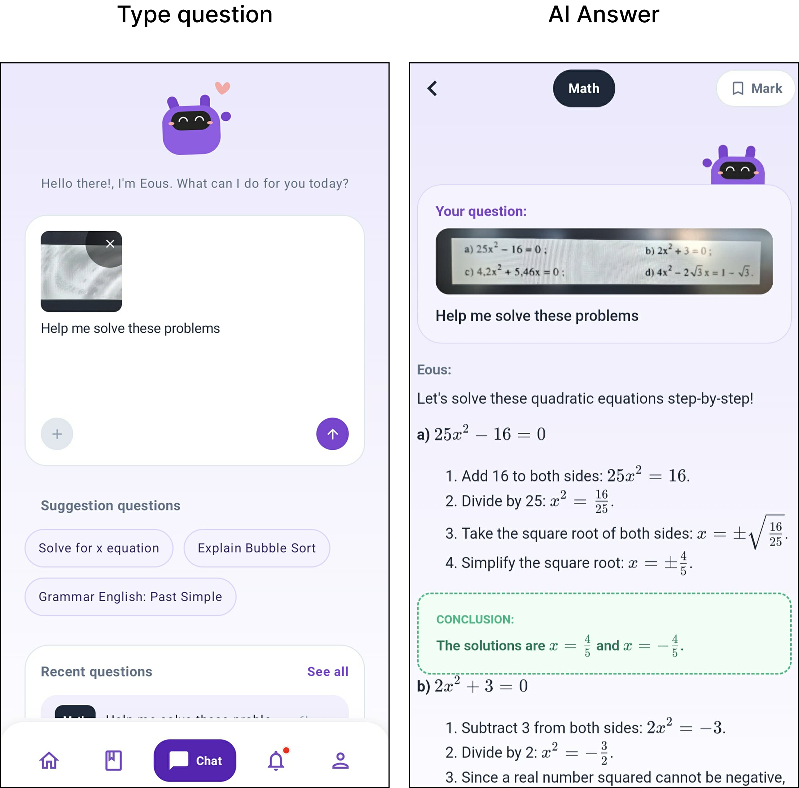
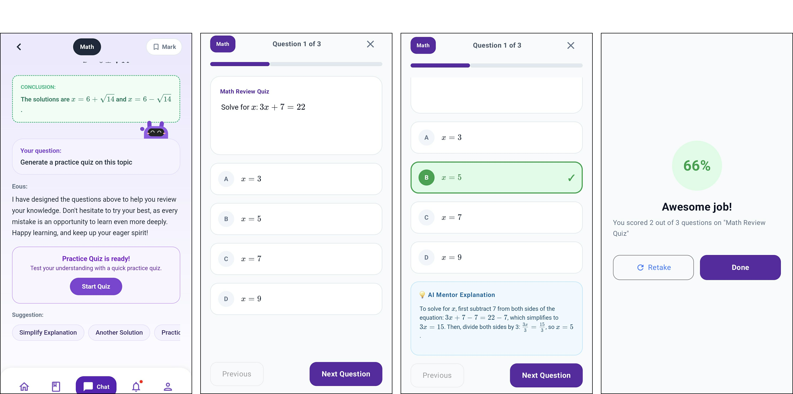
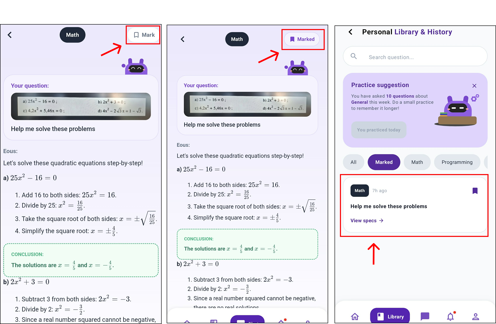

# Eous AI Mentor - Support Documentation & User Guide

Welcome to the **Eous AI Mentor** user support guide. This document serves as the comprehensive user manual for installing, understanding, and operating the Eous AI Mentor Android application.

---

## 1. General Description
* **Application Name**: Eous AI Mentor (AI Study Mentor)
* **Purpose**: Eous AI Mentor is an AI-powered academic assistant designed to provide students with personalized, level-appropriate study support outside formal classroom hours. The application acts as a virtual tutor, giving step-by-step explanations, generating practice quizzes, and helping students solve homework questions.
* **Target Users**: Middle school, high school, and university students who require immediate, reliable assistance with their homework, revision, and study schedules.

---

## 2. Technology Stack & Architecture
Eous AI Mentor is built using modern, production-grade technologies ensuring high performance, security, and maintainability.

* **Programming Language**:
  * **Android Client**: Kotlin (targets SDK 35, minimum SDK 26).
  * **Backend Gateway**: TypeScript (for Supabase Edge Functions).
* **Database & Backend Services (Supabase)**:
  * **Database**: PostgreSQL database instance with Row-Level Security (RLS) enabled.
  * **Authentication**: Supabase Auth supporting registration, login, and Multi-Factor Authentication (MFA).
  * **Storage**: Supabase Storage buckets for uploading homework images scanned via camera/gallery.
* **Client Architecture**:
  * **Clean Architecture**: Structuring code into independent layers: Domain (Usecases/Entities), Data (Repositories/DataSources), and Presentation.
  * **MVVM Pattern**: ViewModels manage UI state and interact with Usecases to cleanly separate business logic from Jetpack Compose layouts.
  * **UI Framework**: Built 100% in declarative **Jetpack Compose** using Kotlin.

---

## 3. User Installation Guide
Follow these instructions to install Eous AI Mentor on your Android device:

1. **Get the APK File**:
   * Navigate to the project’s `release/` or https://github.com/vtniscoding/eous-android/releases/tag/v1.0.0
   * Locate the [eous-ai-mentor-1.0.0.apk](file:///d:/eous-android/release/eous-ai-mentor-1.0.0.apk) file.
   * Transfer this APK file to your Android device (using USB cable, cloud drive, or local sharing).
2. **Allow Installation from Unknown Sources**:
   * On your Android device, go to **Settings > Apps > Special app access > Install unknown apps** (or **Settings > Security** on older Android versions).
   * Enable permission for your File Manager or Web Browser to install unknown applications.
3. **Execute Installation**:
   * Open your device's File Manager, locate the transferred APK file, and tap it.
   * Confirm the prompt by tapping **Install**.
   * Once installed, tap **Open** or launch the app from the application drawer.

---

## 4. Main Features & Detailed Usage Guide

> [!NOTE]
> To compile screenshots representing these screens on your specific environment, run the app in an emulator, capture screenshots for the respective feature flows, save them as PNGs, and place them in the `docs/images/` directory using the names specified below.

### 4.1 Account Registration, Login, & Multi-Factor Authentication (MFA/2FA)
The application enforces email validation and supports Google-standard Time-based One-time Password (TOTP) Multi-Factor Authentication for account security.

 
 
* **How to Use**:
  1. **Register**: Tap **Sign Up** on the welcome screen. Enter a valid email and password (must be at least 8 characters with lowercase, uppercase, and digit symbols).
  2. **Login**: Enter your credentials on the Login screen to access the application dashboard.
  3. **Setup 2FA**: From the **Profile** tab, tap **2-Step Verification**. Scan the generated QR code or copy the secret key into an authenticator app (like Google Authenticator). Enter the 6-digit verification code to activate MFA. Subsequent logins will prompt you for this code.

### 4.2 Dashboard, Daily Streaks, and Achievements (XP & Badges)
The Home screen features gamification elements to encourage consistent learning habits.

 
 

 
* **How to Use**:
  1. **XP Tracking**: View your current Experience Points (XP) progress bar at the top of the Home screen. You earn XP by submitting academic questions, answering generated quiz questions correctly, and logging in daily.
  2. **Daily Streak**: The fire icon tracks your consecutive study days. Interact with the academic chat or complete a quiz daily to keep your streak alive.
  3. **Badges**: View your earned badges (e.g., Streak Milestones, Quiz Master, OCR Scan achievements) in the achievements panel.

### 4.3 Academic Chat & AI Refusal Handling
Ask Eous AI Mentor questions on any academic subjects. The app categorizes questions and blocks non-academic requests.

 
 

* **How to Use**:
  1. **Submit Question**: Navigate to the **Chat** tab, type your academic question (e.g., *"Explain Newton's second law of motion"*), and tap send.
  2. **Subject Classification**: The system automatically labels your request (e.g., *Physics, Math, Chemistry, History*).
  3. **Refusal Handling**: If you ask an out-of-scope question (e.g., *"How do I play games?"*), the AI will refuse to reply. The application automatically deletes this out-of-scope query from the session to keep your history clean.

### 4.4 Homework Image Scanner (OCR Scan)
Scan handwritten math formulas or printed textbook pages directly from your device's camera.

 

* **How to Use**:
  1. In the **Chat** tab, tap the **Camera** icon next to the message input box.
  2. Grant the application camera permissions if prompted.
  3. Align the question box with the text you wish to solve and capture the image (or select a photo from your **Gallery**).
  4. The image is uploaded securely to Supabase Storage, and the Gemini AI reads the text to output a detailed explanation.

### 4.5 AI-Generated Practice Quizzes
Practice makes perfect. Eous AI Mentor generates custom quizzes directly based on the answers you receive.

 

* **How to Use**:
  1. When an AI answer contains clear educational concepts, a **Start Quiz** button appears under the message.
  2. Tap **Start Quiz** to initialize a multiple-choice quiz challenge.
  3. Tap your selected option to get immediate visual feedback (Green for correct, Red for incorrect).
  4. Earn XP rewards upon quiz completion to boost your rank.

### 4.6 Personal Library & Bookmarks (Subject Folders)
Save important explanations to revise later. Bookmarks are organized automatically by subject folders and cached locally for offline reading.

 
 
* **How to Use**:
  1. Tap the **Bookmark** icon at the bottom of any AI message block in the chat window.
  2. The reply is automatically sorted into a subject folder matching the question (e.g., *Chemistry* folder).
  3. Open the **Library** tab to review all saved bookmarks. You can read bookmarked explanations here even when your device is offline.

### 4.7 Leaderboards & Friends Network
Add schoolmates to follow their progress and compete on the XP Leaderboards.

 

* **How to Use**:
  1. In the **Friends** screen, view your unique 8-character user code. Share it with your classmates.
  2. Tap **Add Friend** and input your friend's code to send a friend request.
  3. Once accepted, open the **Leaderboard** tab to view your weekly rank compared to your friends, sorted by XP earned during the current week.
